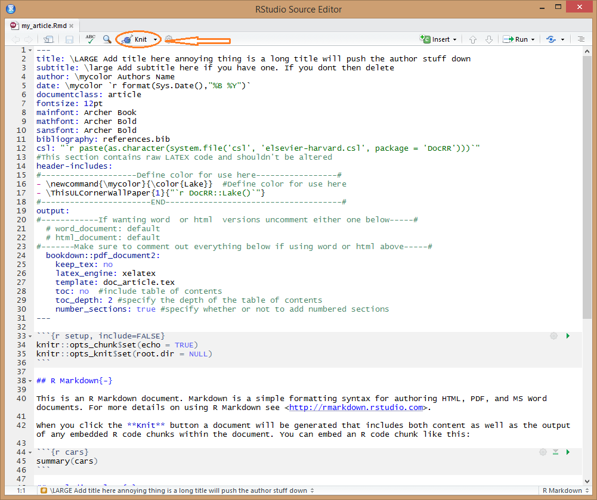

# DocRR

This repository contains a series of templates for creating HTML and PDF documents in rmarkdown using the style themes employed by NZ Department of Conservation (DOC).

In order for PDF output to work you need to make sure you have a LATEX distribution installed. [MIKTEX](https://miktex.org/) is the most common distribution to use.

##Installing the package

First off install the ``devtools`` package if you haven't already.

``install.packages("devtools")``

Now install the ``DocRR`` package using ``devtools::install_github('ogansell/DocRR')``.

##Creating a template in RStudio

RStudio supports these templates natively. 

If using RStudio you can now load pre-made templates for outputting analysis and reporting in HTML or PDF format. To do this go to
File>New File and select 'RMarkdown'

From here you can now load any one of the templates by selecting 
RMarkdown>From Template and selecting any one of the templates under 'DocRR'.

Select the template you want to load, give it a name and save it. 

Important to note here is that when you save your file a folder structure for your file is automatically made. This is because the templates have some extra files they are dependant on in order to compile.

You've now got a template for producing a pdf report to begin working on.
Press the knit button to have a look at what it produces. 

##After installation

When making HTML pages a common intermediate step is to 'knit' your document to '.docx' format. This makes it easy to send to reviewers to get their input. The [webshot](https://cran.r-project.org/web/packages/webshot/vignettes/intro.html) is useful in this instance as it includes a screenshot of any htmlwidgets used in the knitted .docx file. It require installation of the PhantomJS software. This causes installation of the ``DocRR`` package to fail on older installations of R so it is recommended to install this manually after installing ``DocRR``. Do this by running the code ``webshot::install_phantomjs()``.

##Creating a template outside of RStudio

If you're not using RStudio it's still easy to use these templates.

Wrapper functions have been made to make it easy to load a template.

There is one function for each template:

``DocRR::article("myarticle.Rmd")``
``DocRR::article_book("myarticle.Rmd")``
``DocRR::report("myreport.Rmd")``
``DocRR::report_book("myreport.Rmd")``
``DocRR::plain_html("myplainwebpage.Rmd")``
``DocRR::tab_html("mytabbedwebpage.Rmd")``
``DocRR::indicator_html("myindicatorfactsheet.Rmd")``

To compile use your document use ``rmarkdown::render("my_article/my_article.Rmd")``. Remember that you need to point it to the right directory.

